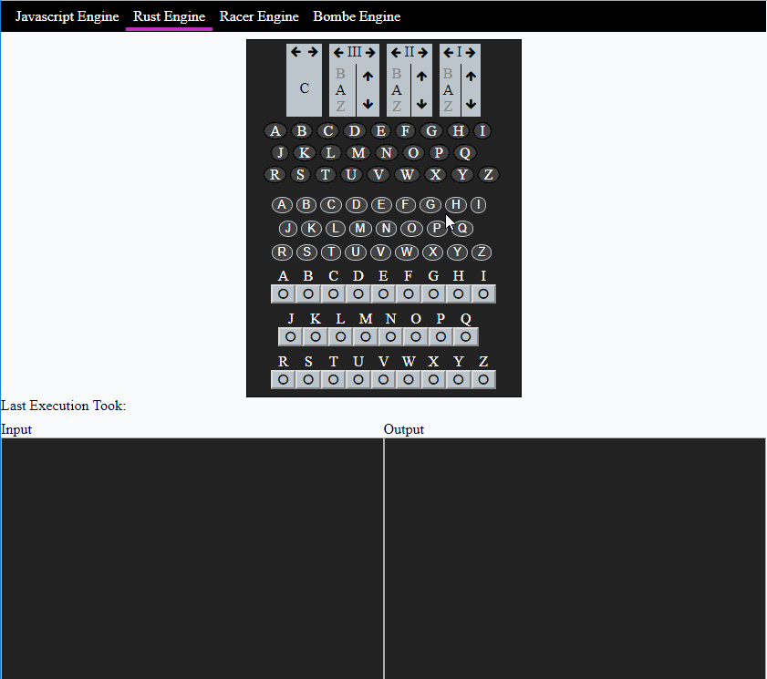

# enigma-wasm
This is a simple project to test perfomance of rust (wasm) and js. The idea was to compare the performance of a native javascript execution verses a rust (wasm compiled) version of the enigma machine.

