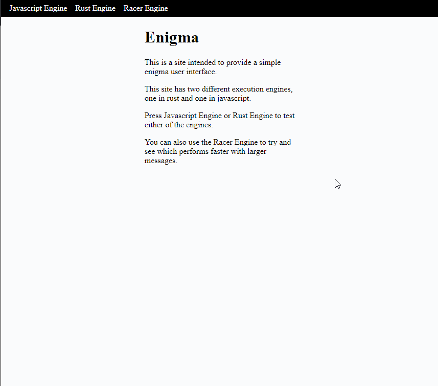

# enigma-wasm
This is a simple project to test perfomance of rust (wasm) and js. The idea was to compare the performance of a native javascript execution verses a rust (wasm compiled) version of the enigma machine.

### Site
A version of this app can be found at http://ilusr.com/enigma/

#### Note
I just threw something up there so there might be issues with the site when attempting to refresh a page or attempt a lighthouse score.
Also this does not appear to work in Edge. I think Edge should have WASM support but I have not looked into that yet.

